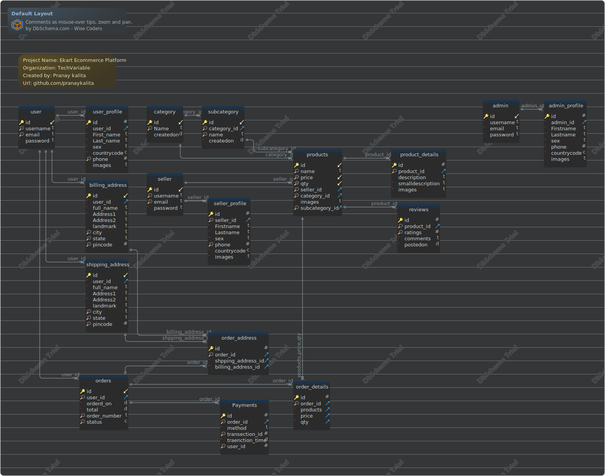

#Default Layout
Generated using [DbSchema](https://dbschema.com)

### Default Layout

## Tables

1. [Default.admin](#table-default.admin) 2. [Default.admin_profile](#table-default.admin\_profile) 3. [Default.billing_address](#table-default.billing\_address) 4. [Default.category](#table-default.category) 5. [Default.order_address](#table-default.order\_address) 6. [Default.order_details](#table-default.order\_details) 7. [Default.orders](#table-default.orders) 8. [Default.Payments](#table-default.payments) 9. [Default.product_details](#table-default.product\_details) 10. [Default.products](#table-default.products) 11. [Default.reviews](#table-default.reviews) 12. [Default.seller](#table-default.seller) 13. [Default.seller_profile](#table-default.seller\_profile) 14. [Default.shipping_address](#table-default.shipping\_address) 15. [Default.subcategory](#table-default.subcategory) 16. [Default.user](#table-default.user) 17. [Default.user_profile](#table-default.user\_profile) 

### Table Default.Payments 
| | | |
|---|---|---|
| * &#128273;  | id| INTEGER  |
| * &#128270; &#11016; | order\_id| INTEGER  |
| * | method| VARCHAR(255)  |
| * &#128270; | transection\_id| INTEGER  |
| * | traenction\_time| DATETIME  |
| * &#128270; | user\_id| INTEGER  |

##### Indexes 
| | | |
|---|---|---|
| &#128273;  | pk\_Payments | ON id|
| &#128270;  | idx\_Payments | ON order\_id, transection\_id, user\_id|

##### Foreign Keys
| | | |
|---|---|---|
|  | fk_payments_orders | ( order\_id ) ref [Default.orders](#orders) (id) |

### Table Default.admin 
| | | |
|---|---|---|
| * &#128273;  &#11019; | id| INTEGER  |
| * | username| VARCHAR(100)  |
| * | email| VARCHAR(100)  |
| * | password| VARCHAR(255)  |

##### Indexes 
| | | |
|---|---|---|
| &#128273;  | pk\_admin\_0 | ON id|

### Table Default.admin_profile 
| | | |
|---|---|---|
| * &#128273;  | id| INTEGER  |
| * &#11016; | admin\_id| INTEGER  |
| * | Firstname| VARCHAR(100)  |
| * | Lastname| VARCHAR(100)  |
| * | sex| VARCHAR(10)  |
| * | phone| INTEGER  |
| * | countrycode| CHAR(2)  |
|  | images| LONG VARCHAR  |

##### Indexes 
| | | |
|---|---|---|
| &#128273;  | pk\_admin\_profile | ON id|

##### Foreign Keys
| | | |
|---|---|---|
|  | fk_admin_profile | ( admin\_id ) ref [Default.admin](#admin) (id) |

### Table Default.billing_address 
| | | |
|---|---|---|
| * &#128273;  &#11019; | id| INTEGER  |
| * &#11016; | user\_id| INTEGER  |
| * | full\_name| VARCHAR(100)  |
| * | Address1| VARCHAR(100)  |
|  | Address2| VARCHAR(100)  |
|  | landmark| VARCHAR(100)  |
| * &#128270; | city| VARCHAR(50)  |
| * &#128270; | state| VARCHAR(50)  |
| * &#128270; | pincode| INTEGER  |

##### Indexes 
| | | |
|---|---|---|
| &#128270;  | idx\_billing\_address | ON city, state, pincode|
| &#128273;  | pk\_billing\_address | ON id|

##### Foreign Keys
| | | |
|---|---|---|
|  | fk_billing_address_user | ( user\_id ) ref [Default.user](#user) (id) |

### Table Default.category 
| | | |
|---|---|---|
| * &#128273;  &#11019; | id| INTEGER  |
| * &#128270; | Name| VARCHAR(100)  |
| * | createdon| DATETIME  |

##### Indexes 
| | | |
|---|---|---|
| &#128273;  | pk\_category | ON id|
| &#128270;  | idx\_category | ON Name|

### Table Default.order_address 
| | | |
|---|---|---|
| * &#128273;  | id| INTEGER  |
| * &#128270; &#11016; | order\_id| INTEGER  |
| * &#11016; | shpping\_address\_id| INTEGER  |
| * &#11016; | billing\_address\_id| INTEGER  |

##### Indexes 
| | | |
|---|---|---|
| &#128273;  | pk\_order\_address | ON id|
| &#128270;  | idx\_order\_address | ON order\_id|

##### Foreign Keys
| | | |
|---|---|---|
|  | fk_order_address_shipping | ( shpping\_address\_id ) ref [Default.shipping\_address](#shipping\_address) (id) |
|  | fk_order_address_billing | ( billing\_address\_id ) ref [Default.billing\_address](#billing\_address) (id) |
|  | fk_order_address_orders | ( order\_id ) ref [Default.orders](#orders) (id) |

### Table Default.order_details 
| | | |
|---|---|---|
| * &#128273;  | id| INTEGER  |
| * &#128270; &#11016; | order\_id| INTEGER  |
| * &#11016; | products| LONG VARCHAR  |
| * &#11016; | price| LONG VARCHAR  |
| * &#11016; | qty| LONG VARCHAR  |

##### Indexes 
| | | |
|---|---|---|
| &#128273;  | pk\_order\_details | ON id|
| &#128270;  | idx\_order\_details | ON order\_id|

##### Foreign Keys
| | | |
|---|---|---|
|  | fk_product_order_details | ( products, price, qty ) ref [Default.products](#products) (id, price, qty) |
|  | fk_order_details_orders | ( order\_id ) ref [Default.orders](#orders) (id) |

### Table Default.orders 
| | | |
|---|---|---|
| * &#128273;  &#11019; | id| INTEGER  |
| * &#128270; &#11016; | user\_id| INTEGER  |
| * | orderd\_on| DATETIME  |
| * | total| DATETIME  |
| * &#128270; | order\_number| VARCHAR(255)  |
| * &#128270; | status| CHAR(1)  |

##### Indexes 
| | | |
|---|---|---|
| &#128273;  | pk\_orders | ON id|
| &#128270;  | idx\_orders | ON order\_number, user\_id, status|

##### Foreign Keys
| | | |
|---|---|---|
|  | fk_orders_user | ( user\_id ) ref [Default.user](#user) (id) |

### Table Default.product_details 
| | | |
|---|---|---|
| * &#128273;  | id| INTEGER  |
| * &#128270; &#11016; | product\_id| INTEGER  |
|  | description| VARCHAR(800)  |
| * | smalldescription| VARCHAR(200)  |
| * | images| LONG VARCHAR  |

##### Indexes 
| | | |
|---|---|---|
| &#128273;  | pk\_product\_details | ON id|
| &#128270;  | idx\_product\_details | ON product\_id|

##### Foreign Keys
| | | |
|---|---|---|
|  | fk_product_details_products | ( product\_id ) ref [Default.products](#products) (id) |

### Table Default.products 
| | | |
|---|---|---|
| * &#128273;  &#11019; | id| INTEGER  |
| * &#128270; | name| VARCHAR(100)  |
| * &#128269; &#11019; | price| FLOAT(50,2)  |
| * &#128269; &#11019; | qty| INTEGER  |
| * &#128270; &#11016; | seller\_id| INTEGER  |
| * &#128270; &#11016; | category\_id| INTEGER  |
| * | images| LONG VARCHAR  |
| * &#128270; &#11016; | subcategory\_id| INTEGER  |

##### Indexes 
| | | |
|---|---|---|
| &#128273;  | pk\_products | ON id|
| &#128270;  | idx\_products | ON seller\_id, name|
| &#128269;  | unq\_products\_id | ON id, price, qty|
| &#128270;  | idx\_products\_0 | ON category\_id, subcategory\_id|

##### Foreign Keys
| | | |
|---|---|---|
|  | fk_products_category | ( category\_id ) ref [Default.category](#category) (id) |
|  | fk_products_subcategory | ( subcategory\_id ) ref [Default.subcategory](#subcategory) (id) |
|  | fk_products_seller | ( seller\_id ) ref [Default.seller](#seller) (id) |

### Table Default.reviews 
| | | |
|---|---|---|
| * &#128273;  | id| INTEGER  |
| * &#128270; &#11016; | product\_id| INTEGER  |
| &#128270; | ratings| INTEGER  |
| * | comments| LONG VARCHAR  |
| * | postedon| DATETIME  |

##### Indexes 
| | | |
|---|---|---|
| &#128273;  | pk\_reviews | ON id|
| &#128270;  | idx\_reviews | ON product\_id, ratings|

##### Foreign Keys
| | | |
|---|---|---|
|  | fk_reviews_products | ( product\_id ) ref [Default.products](#products) (id) |

### Table Default.seller 
| | | |
|---|---|---|
| * &#128273;  &#11019; | id| INTEGER  |
| * &#128270; | username| VARCHAR(100)  |
| * &#128270; | email| VARCHAR(100)  |
| * | password| VARCHAR(255)  |

##### Indexes 
| | | |
|---|---|---|
| &#128273;  | pk\_admin | ON id|
| &#128270;  | idx\_seller | ON username, email|

### Table Default.seller_profile 
| | | |
|---|---|---|
| * &#128273;  | id| INTEGER  |
| * &#128270; &#11016; | seller\_id| INTEGER  |
| * | Firstname| VARCHAR(100)  |
| * | Lastname| VARCHAR(100)  |
| * | sex| VARCHAR(10)  |
| * &#128270; | phone| INTEGER  |
| * | countrycode| CHAR(2)  |
| * | images| LONG VARCHAR  |

##### Indexes 
| | | |
|---|---|---|
| &#128273;  | pk\_seller\_profile | ON id|
| &#128270;  | idx\_seller\_profile | ON seller\_id, phone|

##### Foreign Keys
| | | |
|---|---|---|
|  | fk_seller_profile_saler | ( seller\_id ) ref [Default.seller](#seller) (id) |

### Table Default.shipping_address 
| | | |
|---|---|---|
| * &#128273;  &#11019; | id| INTEGER  |
| * &#11016; | user\_id| INTEGER  |
| * | full\_name| VARCHAR(100)  |
|  | Address1| VARCHAR(100)  |
| * | Address2| VARCHAR(100)  |
|  | landmark| VARCHAR(100)  |
| * &#128270; | city| VARCHAR(50)  |
| * &#128270; | state| VARCHAR(50)  |
| * &#128270; | pincode| INTEGER  |

##### Indexes 
| | | |
|---|---|---|
| &#128270;  | idx\_shipping\_address\_id | ON id, city, state, pincode|
| &#128273;  | pk\_shipping\_address | ON id|

##### Foreign Keys
| | | |
|---|---|---|
|  | fk_shipping_address | ( user\_id ) ref [Default.user](#user) (id) |

### Table Default.subcategory 
| | | |
|---|---|---|
| * &#128273;  &#11019; | id| INTEGER  |
| * &#128270; &#11016; | category\_id| INTEGER  |
| * &#128270; | name| VARCHAR(100)  |
| * | createdon| DATETIME  |

##### Indexes 
| | | |
|---|---|---|
| &#128270;  | idx\_subcategory | ON category\_id|
| &#128269;  | unq\_subcategory\_id | ON id|
| &#128273;  | pk\_subcategory | ON id|
| &#128270;  | idx\_subcategory\_0 | ON name|

##### Foreign Keys
| | | |
|---|---|---|
|  | fk_subcategory_category | ( category\_id ) ref [Default.category](#category) (id) |

### Table Default.user 
| | | |
|---|---|---|
| * &#128273;  &#11019; | id| INTEGER  |
| * &#128270; | username| VARCHAR(100)  |
| * &#128270; | email| VARCHAR(100)  |
| * | password| VARCHAR(255)  |

##### Indexes 
| | | |
|---|---|---|
| &#128273;  | pk\_user | ON id|
| &#128270;  | idx\_user | ON email, username|

### Table Default.user_profile 
| | | |
|---|---|---|
| * &#128273;  | id| INTEGER  |
| * &#11016; | user\_id| INTEGER  |
| * | First\_name| VARCHAR(100)  |
| * | Last\_name| VARCHAR(100)  |
| * | sex| VARCHAR(10)  |
| * | countrycode| CHAR(2)  |
| * &#128270; | phone| INTEGER  |
|  | images| VARCHAR(255)  |

##### Indexes 
| | | |
|---|---|---|
| &#128273;  | pk\_user\_profile | ON id|
| &#128270;  | idx\_user\_profile | ON phone|

##### Foreign Keys
| | | |
|---|---|---|
|  | fk_user_profile_user | ( user\_id ) ref [Default.user](#user) (id) |

